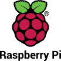

# Make IoT - Build Edge and IoT Linux Apps

`mkiot` build IoT apps artifacts for Edge and IoT Linux devices.

    
    

    


Index:

- [Introduction](#introduction)

- [Install](#install)

- [Build spec syntax](#build-spec-syntax)

- [Examples](#examples)
    - 

## Introduction

`mkiot` build IoT apps artifacts for Edge and IoT Linux devices. Internally It uses `debootstrap` and other classic Linux tools. `mkiot` provides these benefits:

* Produces classic archives format: `tar archive` files. Other formats like `zip` etc will be added soon.

* Supports multi-stage builds to optimize images and produce lightweight IoT apps.

* Only the build envrionment is defined, the execution environment is not defined nor enforced.


## Install


### Dependencies

`mkiot` needs the following packages `qemu`, `qemu-user-static`, `binfmt-support`, `systemd-nspawn`, `deboostrap` and
`python yq package and tool`.


To install the necessary dependencies on `debian` or `ubuntu`:

- qemu qemu-user-static
```bash
        sudo apt-get install qemu qemu-user-static
```

- binfmt-support
```bash
        sudo apt-get install binfmt-support
```

- systemd-container or systemd-nspawn
```bash
        sudo apt-get install systemd-container
```

- deboostrap
```bash
        sudo apt-get install debootstrap
```

- Python packages:
    - yq: Command-line YAML/XML processor. [yq Link](https://kislyuk.github.io/yq/).
    - pyyaml: PyYAML is a YAML parser and emitter for Python. [PyYaml Link](https://github.com/yaml/pyyaml).
```bash
        pip install yq
        pip install pyyaml
```


Of course it needs other tools that should be installed: "python, bash, tar, zip"


### Install

After cloning this repository:

```bash
git clone https://github.com/ionoid/mkiot.git
```

Install:
```bash
cd mkiot
sudo ./install.bash
```

To uninstall:
```bash
sudo ./uninstall.bash
```


## Build Spec syntax

`mkiot` use build specs that are expressed in [YAML](https://yaml.org) format to define how to build the application
image.

If a field contains a character, or a string of characters, that is not supported by YAML,
you must enclose the command in quotation marks ("").

Buildspec format:

```yaml
version: 0.1

arch: armhf
build-directory: build/

env:
        variables:
                key: "value"
                key1: "value"

cache:
        images:
                - /var/lib/mkiot/images/cache/

phases:
        installs:
                - image: debian
                  mirror: http://deb.debian.org/debian/
                  release: buster
                  name: debian-armhf-dev
                  cache: "save,reuse"
                  install-args:
                  runtime-versions:
                  commands:
                        - ["command"]
                        - ["command", "arg1", "arg2" ]

                - image: debian
                  name: debian-armhf-prod
                  cache: "reuse"
                  install-args:
                  shell: "bash"


        pre-builds:
                # Set what image to use from installs
                - use: debian-armhf-dev
                  commands:
                        - ["command"]
                        - ["script", "scriptfile", "/bin/scriptfile"]

        builds:
                # Set what image to use from installs
                - use: debian-armhf-dev
                  commands:
                        - ["command"]
                        - ["command"]
                        - ["command"]

                # Use debian-armhf-prod image as target
                - use: debian-armhf-prod
                  commands:
                        # copy from dev image to prod image
                        - ["copy", "--from=debian-armhf-dev", "source_file", "destination_file" ]
                        - ["command"]

        post-builds:
                - use: debian-armhf-prod
                  commands:
                        - ["command"]
                        - ["command"]
                        - ["command"]

artifacts:
        - use: debian-armhf-prod
          name: debian-stretch-armhf
          suffix: date +%Y-%m-%d
          commands:
                - ["copy", "app.yaml", "app.yaml" ]
          files:
                - app.yaml app.yaml
                - file.conf /etc/file.conf
          compression: tar

```


* `version`: represents the buildspec version. Required field.

* `arch`: required fields represents the target board architecture. Possible values are: `i386`, `amd64`, `armhf` and `arm64`.

* `build-directory`: the location where to reproduce builds. If not set default location will be `mkiot-output` in the current directory.

* `env`: optional field contains environment variables that are passed to all commands of the buildpsec. The environment variables are inside `variables` as keys and values.

* `cache`: optional cache where to find previous images that were downloaded and cached. By default it is set to `/var/lib/mkiot/images/cache/`. Please do not set this unless you know what you are doing, in this case you have to cleanup the cache manually. Images inside the default cache folder `/var/lib/mkiot/images/cache/` that are older than 60 days will be removed next `mkiot` run.

* `phases`: Represents the different phases of a build. This is a required field must contain the `installs` phase and at least one of the `pre-builds`, `builds` or `post-builds` phases.

    * `installs`: a list of different images to install that are necessary to build and produce the application artifact. This should be used to only download images or use the ones from the cache to install packages.

        * `image`: required field in `installs` contains the base distribution name to use as a file system for the application. Current supported values are [debian](https://www.debian.org/), and `scratch` for an empty Linux file system.

        * `mirror`: optional field to define the mirror where to download the distribution from.

        * `release`: optional field to define the release code name of distribution to use.
        
        * `name`: required field to define how to name the directory that contains the downloaded distribtion or the one that was copied from cache.

        * `cache`: optional field to specify how to use the cache. Possible values are `save`, `reuse` or both separated by `,`. Save means after finishing downloading this image and executing the commands save it into cache for future usage, overwriting any previous saved image that has same `name` field. Reuse means if this image is in the cache do not download it again and just copy it into the `build-directory` and use it.

        * `commands`: optional sequence of commands with their arguments that are executed according to their order. Command example: `["/bin/echo", "hello"]`.

    * `pre-builds`: optional sequence of commands to prepare the build environment.

        * `use`: the name of the image to use. It has to be the `name` field of one of the images that were installed during the `installs` phase.

        * `commands`: optional sequence of commands with their arguments that are executed according to their order. Command example: `["/bin/echo", "hello"]`.

    * `builds`: optional sequence of commands to build the application.

        * `use`: the name of the image to use. It has to be the `name` field of one of the images that were installed during the `installs` phase.

        * `commands`: optional sequence of commands with their arguments that are executed according to their order. Command example: `["/bin/echo", "hello"]`.

    * `post-builds`: optional sequence of commands to run after the build. These can be used to produce final files necesary to build the artifact, clean up files or even push notifications.

        * `use`: the name of the image to use. It has to be the `name` field of one of the images that were installed during the `installs` phase.

        * `commands`: optional sequence of commands with their arguments that are executed according to their order. Command example: `["/bin/echo", "hello"]`.


* `artifacts`: required field that specifies how to produce the final artifacts. All produced artifacts can be found inside the `$build-directory/artifacts/` directory.

    * `use`: the name of the image to use. It has to be the `name` field of one of the images that were installed during the `installs` phase.

    * `name`: optional field that contains the name the final artifact. If not set it will use the same name of the field `use`.
    
    * `suffix`: optional field that will be appended to the name of the final artifact. This can be a bash command where the output is the `suffix`.

    * `commands`: optional sequence of commands with their arguments that are executed according to their order. Command example: `["/bin/echo", "hello"]`. This can be used to copy files and directories into the final artifacts. As an example an `app.yaml` file that defines how to run the application.

    * `files`: optional sequence of files and directories that are copied from the host file system into the final artifact. First element is the file or directory location on the host, and second element is where to copy the files or directories inside the artifact.

    * `compression`: specifies the archive and compression format to use, by default it uses the `tar archive` format.


### Build spec commands documentation

Commands are sequences that are executed inside the image or the build environment one at a time, in the order listed.
Each command can be any command that refers to a binary or shell command inside the image, beside that there are some
special commands that will make it easy to automate the build process

During the `installs` phase, commands are executed inside the image environment that was named by the `name` field.
During other build stages, commands are executed inside the image environment that was specified by the `use` field.


* `script`: the script command allows to pass directly a script inside the image and execute it, it is done by bind mounting the script inside the image. This is useful instead of passing multiple sequences of commands; the commands are inside the script file which is executed. The script can be either `bash`, `python` etc. Please note that the script will not be copied inside the image.

    * `script` syntax: the `script` command syntax is: `[ "script", "scriptfile", "/bin/scriptfile" ]`
    
        * `"script"`: first element is the command.
        
        * `"scriptfile"`: the second element is the script file location on the host file system.
        
        * `"/bin/scriptfile"`: last element is optional. Specify where to make the script available inside the image. Usually using `/bin/` inside image is enough which is the default operation anyway if the third element is not specified.


* `copy`: the copy command allows to copy files and directories between multiple images and local file system. Internally it invokes the Unix `cp` command with `-a` as argument so directories are copied recursively with permissions preserved if possible. For further details please read [cp manual](https://linux.die.net/man/1/cp).

    * `copy` syntax: the `copy` command syntax is: `["copy", "--from=image-name", "source", "destination" ]

        * `"copy"`: first element is the command.

        * `"--from=image-name"`: second element is optional and allows to copy files and directories from other images and build envrionments to perform multi-stage builds. The `image-name` must be a `name` field of one of the images that were installed during the `installs` phase.

        * `"source"`: specifies the source files or directories to be copied from host or another image into the target image name that was specified inside the `use` field.

        * `"destination"`: specifies the destination inside the image environment where to copy the files or directories.


## Examples

The following examples demonstrate how to build an IoT package for Linux. The package includes the application with all its
dependencies inside a `tar archive` file. There are multiple Linux distributions that can be used as a base file system
for applications, the next section details this more.


### Debian based images

[Debian](https://www.debian.org/) is a free operation system (OS) for PC. Using `mkiot` tools we can build a minimal Debian
based file system for applications without a Linux kernel nor other tools needed to run a complete OS. `mkiot` makes use
of [debootstrap](https://wiki.debian.org/Debootstrap) to install the system.


* Minimal Debian file system:

```bash
sudo mkiot build examples/debian/buildspec.yaml
```


* Development Debian with build essential packages:

```bash
sudo mkiot build examples/devtools/debian/buster/buildspec-devtools-armhf.yaml
```

#### Node.js based on Debian

* Node.js Debian file system:

[Node.js
package](https://nodejs.org/en/download/package-manager/#debian-and-ubuntu-based-linux-distributions-enterprise-linux-fedora-and-snap-packages) from usptream with minimal debian:
```bash
sudo mkiot build examples/node.js/debian/buster/buildspec-node.js-minimal-debian-armhf.yaml
```

Node.js binary from upstream with extra `devtools`, `build essential` and `yarn` installed:
```bash
sudo mkiot build examples/node.js/14/buster/buildspec-node.js-devtools-debian-armv7l.yaml
```

#### Python based on Debian

* Python Debian file system:

Development Debian already includes `python2`
```bash
sudo mkiot build examples/devtools/debian/buster/buildspec-devtools-armhf.yaml
```

Python3 with minimal file system:
```bash
sudo mkiot build examples/python/debian/buster/buildspec-python3-minimal-debian-armhf.yaml
```

Python3 with extra devtools file system:
```bash
sudo mkiot build examples/python/debian/buster/buildspec-python3-devtools-debian-armhf.yaml
```


### Alpine based file system

To be added soon.


### Scratch file system

Scratch based file system contains empty directories parts of the [Filesystem Hierarchy
Standard](https://en.wikipedia.org/wiki/Filesystem_Hierarchy_Standard). The directories are empty on purpose, which
allows to build images on top.

* Scratch file system example:

```bash
sudo mkiot build examples/scratch/buildspec.yaml
```
