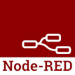

# Node-RED



[Node-RED](https://nodered.org/)is a programming tool for wiring together hardware devices, APIs and online services in new and interesting ways.


## Node-RED Debian Based Image

To build Node-RED for `ARM` architectures and produce an artifact, we use the following:

- [Node-RED Buildspec yaml file](./debian/buster//node-red_node-14_minimal_debian_armhf.yaml)
- [Node.js install script](debian/buster/node-install.sh)

- [Node-RED app.yaml file](./app.yaml)


To build Node-RED artifact, make sure you are in this directory:

```bash
cd examples/apps/node-red/
sudo mkiot build debian/buster/node-red_node-14_minimal_debian_armhf.yaml
```

### Test Node-RED locally

```bash
sudo systemd-nspawn -D output/node_minimal_debian-buster_armhf/
node-red
```

Then open your browser at [http://127.0.0.1:1880/](http://127.0.0.1:1880/)


## Node-RED Alpine Based Image

To be added soon.
